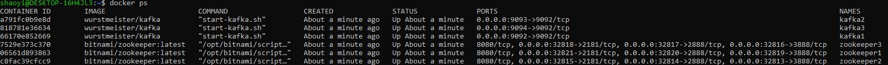
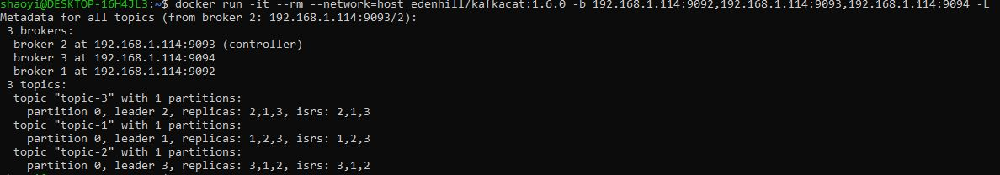
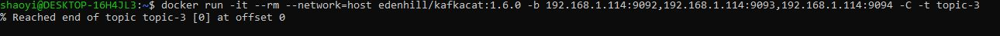
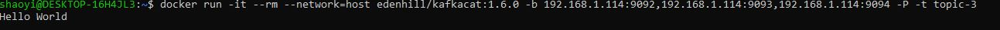
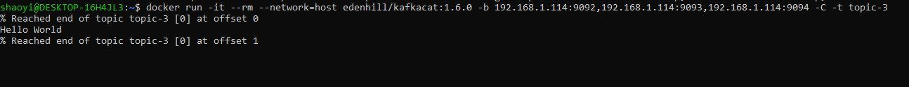
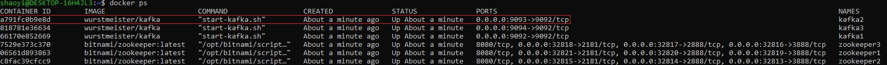
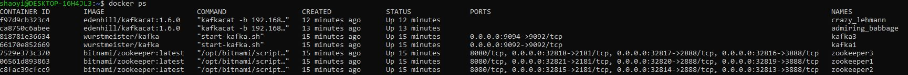
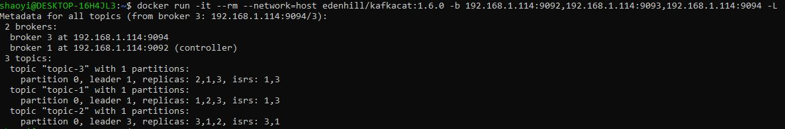
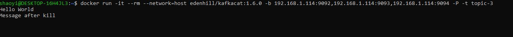
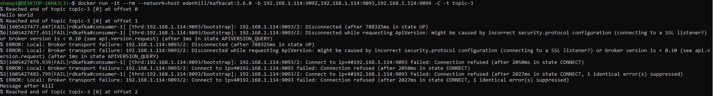

# 3 Node Kafka Cluster - Zookeeper Ensemble

This application uses a 3 node kafka cluster and a 3-Zookeeper ensemble to demonstrate Publish-Subscribe Messaging. This application is built using Docker-Compose, along with popular images of Kafka, Zookeeper and Kafkacat.

## Perquisites

Ensure that you have the following perquisites installed.

1.  Docker
    - Follow [these instructions](https://docs.docker.com/docker-for-windows/install/) to install Docker.
2.  Docker Compose
    - Follow [these instructions](https://docs.docker.com/compose/install/) to install Docker Compose.

## Docker Images Used

- **Kafka**: [wurstmeister/kafka](https://hub.docker.com/r/wurstmeister/kafka/)
- **Zookeeper**: [bitnami/zookeeper](https://hub.docker.com/r/bitnami/zookeeper)
- **Kafkacat**: [edenhill/kafkacat](https://hub.docker.com/r/edenhill/kafkacat)

## Setup

1. Clone this repository with the following command

```
git clone https://github.com/shaoyi1997/kafka-cluster-zookeeper.git
```

2. The repository contains a single `docker-compose.yml` file that specifies the configuration of the application.

   - Of particular importance is the environment variable `KAFKA_ADVERTISED_HOST_NAME` for each Kafka node. This _must be_ replace with your machine's **private IP address**. For instance, my private IP address is `192.168.1.114`.
   - If you are using `docker-machine`, change this to the container's IP address. The default IP address for `docker-machine` is `192.168.99.100`.

3. In the repository, run the following command to pull the Docker images and run the application.

```
docker-compose up -d
```

4. Run `docker ps` to verify that all containers are up.

   The following screenshot demonstrates a successful running instance of this application.

   

5. We shall use `Kafkacat` to interact with the cluster. `Kafkacat` is a command line utility that you can use to test and debug Apache Kafka deployments.

   Run the following command to pull the `edenhill/kafkacat` Docker image.

```
docker pull edenhill/kafkacat:1.6.0
```

6. Run the following command to view the Kafka brokers and topics in a metadata listing.

```
docker run -it --rm --network=host edenhill/kafkacat:1.6.0 -b 192.168.1.114:9092,192.168.1.114:9093,192.168.1.114:9094 -L
```

> Note: Replace all instances of IP address with your private IP address.

The following screenshot demonstrates a successful running instance of this application.



From our compose configuration, under `KAFKA_CREATE_TOPICS`, we have preset 3 topics to be created upon setup: `topic-1`, `topic-2`, and `topic-3`. Each topic will have 1 partition and 3 replicas. We can see that Broker 2 is currently the leader of `topic-3`, and also the Controller Broker. Your instance may be different from this.

## Publish-Subscribe Messaging Capabilities

Now, we are ready to demonstrate Kafka's Pub-Sub capability, using `topic-3` as our running example.

1. Run the following command to enter Consumer mode that allows you to consume the messages from `topic-3`.

```
docker run -it --rm --network=host edenhill/kafkacat:1.6.0 -b 192.168.1.114:9092,192.168.1.114:9093,192.168.1.114:9094 -C -t topic-3
```

As we have just setup the cluster, there is no content in `topic-3` as yet, and thus, we also observe that the offset is `0`, as seen below.



2. Without exiting the Consumer console, run the following command in another console that enables you to enter Producer mode that allows you to produce messages under `topic-3`.

```
docker run -it --rm --network=host edenhill/kafkacat:1.6.0 -b 192.168.1.114:9092,192.168.1.114:9093,192.168.1.114:9094 -P -t topic-3
```

3. Let's try sending a `Hello World` message in the Producer console!



In the Consumer console, you will see that the Consumer receives the `Hello World` message in real time.



With this, we have demonstrate Pub-Sub messaging!

## Zookeeper Ensemble

To demonstrate handling of a Kafka failover, we will kill Broker 2, which we have observed is currently the leader for `topic-3` and the Controller broker. It also runs on port `9093`.

From the output of `docker-ps`, we can identify that the `CONTAINER ID` of the container running on port `9093` is `a791fc0b9e8d`, as seen below.



1. We can kill this container with the following command.

```
docker rm -f a791fc0b9e8d
```

2. We can verify that this container has been killed using `docker ps`.



3. Afterwhich, you may view the new leader for `topic-3` and Controller Broker by viewing the metadata listing using the following command.

```
docker run -it --rm --network=host edenhill/kafkacat:1.6.0 -b 192.168.1.114:9092,192.168.1.114:9093,192.168.1.114:9094 -L
```

The following screenshot shows a sample output.



We can see that `broker 1` has overtook as the Controller broker and is also the new leader of `topic-3`.

4. We can also verify that sending messages to `topic-3` also works after the Kafka failover by performing the previous steps on producing and consuming messages.

The following screenshots demonstrate the successful production and consumption of messages under `topic-3` after failover.

Produce:


Consume:


As shown, we see that the message `Message after kill` has been sent and received in the respective consoles.

## Termination

To terminate the application, run the following command.

```
docker-compose down
```
